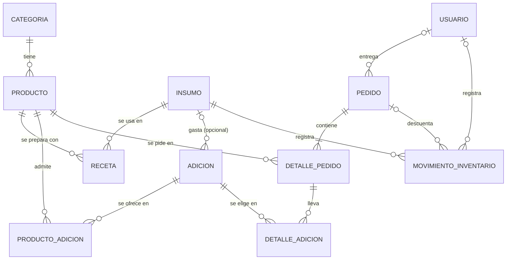

# Capycoffe: diagrama entidad-relación

Se ve como dibujo en GitHub y en cualquier editor que muestre Mermaid. El detalle de columnas está en `01_esquema.sql`.

```mermaid
erDiagram
  CATEGORIA ||--o{ PRODUCTO : tiene
  PRODUCTO ||--o{ RECETA : "se prepara con"
  INSUMO ||--o{ RECETA : "se usa en"
  PRODUCTO ||--o{ PRODUCTO_ADICION : admite
  ADICION ||--o{ PRODUCTO_ADICION : "se ofrece en"
  INSUMO |o--o{ ADICION : "gasta (opcional)"
  PEDIDO ||--|{ DETALLE_PEDIDO : contiene
  PRODUCTO ||--o{ DETALLE_PEDIDO : "se pide en"
  DETALLE_PEDIDO ||--o{ DETALLE_ADICION : lleva
  ADICION ||--o{ DETALLE_ADICION : "se elige en"
  INSUMO ||--o{ MOVIMIENTO_INVENTARIO : registra
  PEDIDO |o--o{ MOVIMIENTO_INVENTARIO : descuenta
  USUARIO |o--o{ PEDIDO : entrega
  USUARIO |o--o{ MOVIMIENTO_INVENTARIO : registra
```
